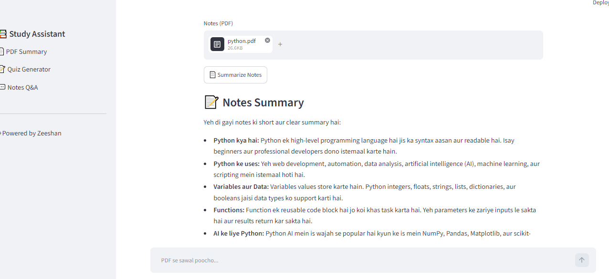
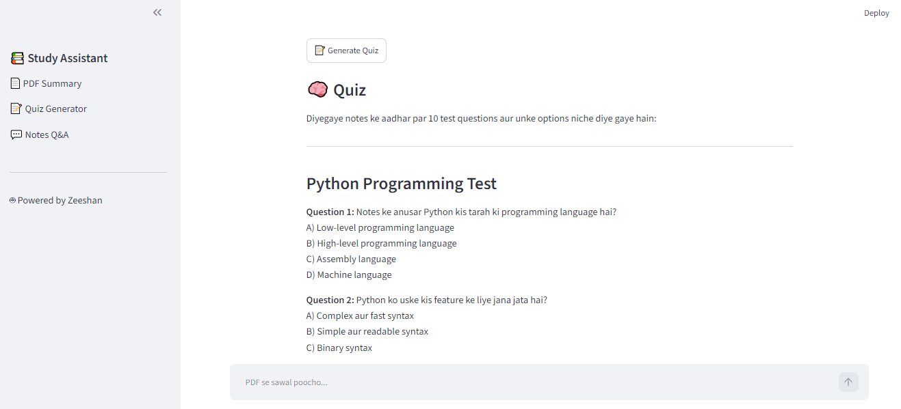
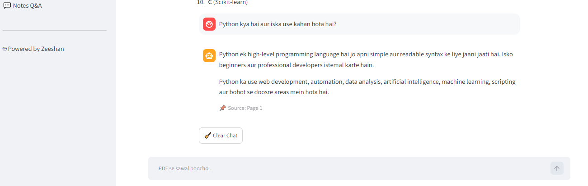

# 📚 AI Study Assistant

AI Study Assistant is a Python and Streamlit application that helps students interact with PDF study material using Google Gemini AI.

## 🚀 Features

- 📄 Upload PDF study material
- 💬 Ask questions from PDF content
- 🧠 Basic RAG-based retrieval
- 🔢 Text embeddings and similarity-based search
- 📝 Generate study summaries
- ❓ Generate quizzes
- 🎨 Interactive Streamlit interface

## 🛠️ Tech Stack

- Python
- Streamlit
- Google Gemini API
- NumPy
- PyPDF
- Basic RAG and Text Embeddings

## 📦 Installation

Clone the repository:

```bash
git clone https://github.com/buildbyzeeshan/ai-study-assistant.git
```

Install the required packages:

```bash
pip install -r requirements.txt
```

## 🔑 API Configuration

This project requires a Google Gemini API key.

Configure the API key securely using Streamlit secrets. Do not store API keys directly in the source code.

## ▶️ Run the Application

```bash
streamlit run smart_assistent.py
```

## 📁 Project Structure

```text
ai-study-assistant/
├── smart_assistent.py
├── requirements.txt
└── README.md
```

## 🎯 Project Purpose

This project demonstrates the fundamentals of Retrieval-Augmented Generation (RAG) using PDF text extraction, basic chunking, text embeddings, similarity-based retrieval, and Gemini AI.

## 👨‍💻 Developer

Built by **Zeeshan*


* as part of my AI development portfolio.
* ## 📸 Application Screenshots

### 📝 AI PDF Summary


### ❓ AI Quiz Generator


### 💬 PDF Question & Answer

